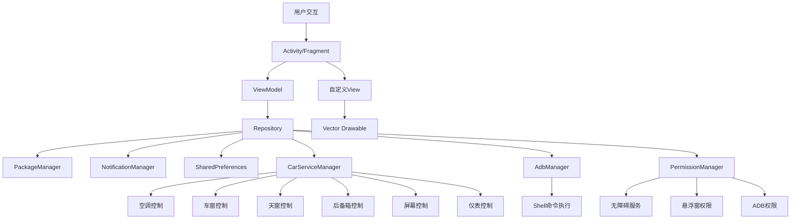

## 1. Architecture Design
原生Android车载桌面应用架构，采用MVVM模式，确保高性能和低资源占用。新增车机硬件控制、权限管理、投屏显示等模块。



## 2. Technology Description
- **语言**: Kotlin
- **最低SDK**: API 29 (Android 10)
- **目标SDK**: API 29
- **架构模式**: MVVM
- **UI框架**: 原生Android View系统 + ConstraintLayout
- **异步处理**: Coroutines + Flow
- **数据持久化**: SharedPreferences
- **构建工具**: Gradle (Kotlin DSL)
- **设计规范**: Material Design Components
- **图标**: Vector Drawable
- **权限获取**: 无线ADB + 无障碍服务 + 系统权限

## 3. Core Components
| Component | Purpose |
|-----------|---------|
| HomeActivity | 主桌面Activity |
| StatusBarView | 自定义状态栏 |
| NavBarView | 底部导航栏 |
| AppDrawerFragment | 应用抽屉 |
| NotificationPanel | 通知中心 |
| QuickAppsView | 快捷应用网格 |
| ClockWeatherView | 时钟天气显示 |
| CarControlPanel | 车机控制面板 |
| DisplayControlPanel | 显示控制面板 |
| NavigationModule | 导航与投屏模块 |
| SplitScreenManager | 分屏管理器 |
| AdbManager | ADB权限管理 |
| PermissionManager | 权限统一管理 |
| CarServiceManager | 车机服务管理 |

## 4. Data Model
```kotlin
// 应用信息
data class AppInfo(
    val packageName: String,
    val appName: String,
    val icon: Drawable,
    val lastUsed: Long,
    val launchCount: Int
)

// 通知信息
data class NotificationInfo(
    val id: Int,
    val title: String,
    val content: String,
    val appName: String,
    val postTime: Long,
    val priority: Int
)

// 用户设置
data class UserSettings(
    val theme: Theme = Theme.DARK,
    val wallpaperUri: String? = null,
    val favoriteApps: List<String> = emptyList(),
    val adbEnabled: Boolean = false,
    val accessibilityEnabled: Boolean = false,
    val floatingWindowEnabled: Boolean = false
)

// 空调状态
data class AirConditionState(
    val temperature: Float = 24.0f,
    val windLevel: Int = 3,
    val mode: AirMode = AirMode.AUTO,
    val isOn: Boolean = true
)

// 车窗状态
data class WindowState(
    val frontLeft: Boolean = false,
    val frontRight: Boolean = false,
    val rearLeft: Boolean = false,
    val rearRight: Boolean = false
)

// 显示设置
data class DisplaySettings(
    val screenBrightness: Int = 80,
    val instrumentBrightness: Int = 60,
    val isScreenOn: Boolean = true,
    val isMapProjected: Boolean = false
)

enum class Theme { LIGHT, DARK, AUTO }
enum class AirMode { AUTO, COOL, HEAT, VENT, DEFROST }
```

## 5. File Structure
```
/workspace
├── app/
│   ├── src/
│   │   ├── main/
│   │   │   ├── java/com/carlauncher/
│   │   │   │   ├── MainActivity.kt
│   │   │   │   ├── ui/
│   │   │   │   │   ├── home/
│   │   │   │   │   │   ├── HomeActivity.kt
│   │   │   │   │   │   └── HomeViewModel.kt
│   │   │   │   │   ├── components/
│   │   │   │   │   │   ├── StatusBarView.kt
│   │   │   │   │   │   ├── NavBarView.kt
│   │   │   │   │   │   ├── AppDrawer.kt
│   │   │   │   │   │   ├── NotificationPanel.kt
│   │   │   │   │   │   ├── QuickAppsView.kt
│   │   │   │   │   │   ├── ClockWeatherView.kt
│   │   │   │   │   │   ├── CarControlPanel.kt
│   │   │   │   │   │   ├── DisplayControlPanel.kt
│   │   │   │   │   │   ├── NavigationModule.kt
│   │   │   │   │   │   └── SplitScreenView.kt
│   │   │   │   │   ├── adapter/
│   │   │   │   │   │   └── AppGridAdapter.kt
│   │   │   │   │   └── settings/
│   │   │   │   │       ├── SettingsActivity.kt
│   │   │   │   │       └── PermissionSettingsActivity.kt
│   │   │   │   ├── data/
│   │   │   │   │   ├── AppRepository.kt
│   │   │   │   │   ├── CarServiceRepository.kt
│   │   │   │   │   ├── model/
│   │   │   │   │   │   ├── AppInfo.kt
│   │   │   │   │   │   ├── NotificationInfo.kt
│   │   │   │   │   │   ├── UserSettings.kt
│   │   │   │   │   │   ├── AirConditionState.kt
│   │   │   │   │   │   ├── WindowState.kt
│   │   │   │   │   │   └── DisplaySettings.kt
│   │   │   │   │   └── prefs/
│   │   │   │   │       └── PreferencesManager.kt
│   │   │   │   ├── service/
│   │   │   │   │   ├── CarAccessibilityService.kt
│   │   │   │   │   ├── FloatingMapService.kt
│   │   │   │   │   └── AdbConnectionService.kt
│   │   │   │   ├── manager/
│   │   │   │   │   ├── AdbManager.kt
│   │   │   │   │   ├── PermissionManager.kt
│   │   │   │   │   ├── CarServiceManager.kt
│   │   │   │   │   ├── DisplayManager.kt
│   │   │   │   │   └── SplitScreenManager.kt
│   │   │   │   └── utils/
│   │   │   │       ├── Extensions.kt
│   │   │   │       ├── Constants.kt
│   │   │   │       └── ShellUtils.kt
│   │   │   ├── res/
│   │   │   │   ├── drawable/          # Vector Drawable 图标
│   │   │   │   ├── layout/            # XML布局文件
│   │   │   │   ├── values/            # 字符串、颜色、尺寸
│   │   │   │   └── mipmap/            # 启动图标
│   │   │   └── AndroidManifest.xml
│   │   └── test/
│   └── build.gradle.kts
├── gradle/
├── build.gradle.kts
├── settings.gradle.kts
└── gradle.properties
```

## 6. Permission Architecture

### 6.1 ADB Permission
```kotlin
class AdbManager(private val context: Context) {
    // 无线ADB连接
    fun connectWirelessAdb(ip: String, port: Int = 5555)
    // 执行Shell命令
    fun executeShellCommand(command: String): String
    // 检查ADB权限
    fun hasAdbPermission(): Boolean
    // 自动配对
    fun autoPair(pairingCode: String)
}
```

### 6.2 Accessibility Service
```kotlin
class CarAccessibilityService : AccessibilityService() {
    // 全局返回
    fun performGlobalBack()
    // 获取当前窗口
    fun getCurrentWindow(): AccessibilityNodeInfo?
    // 检测应用启动
    override fun onAccessibilityEvent(event: AccessibilityEvent)
}
```

### 6.3 Floating Window
```kotlin
class FloatingMapService : Service() {
    // 显示悬浮窗
    fun showFloatingWindow()
    // 隐藏悬浮窗
    fun hideFloatingWindow()
    // 调整大小
    fun resizeWindow(width: Int, height: Int)
    // 调整位置
    fun moveWindow(x: Int, y: Int)
}
```

## 7. Car Service Architecture

### 7.1 Service Interface
```kotlin
interface CarServiceInterface {
    // 空调控制
    fun setAirConditionTemp(temp: Float)
    fun setAirConditionWindLevel(level: Int)
    fun setAirConditionMode(mode: AirMode)
    fun turnOnAirCondition()
    fun turnOffAirCondition()
    
    // 车窗控制
    fun controlWindow(window: WindowPosition, open: Boolean)
    fun controlAllWindows(open: Boolean)
    
    // 天窗控制
    fun openSunroof()
    fun closeSunroof()
    fun controlSunshade(open: Boolean)
    
    // 后备箱控制
    fun openTrunk()
    fun closeTrunk()
    
    // 屏幕控制
    fun turnOffScreen()
    fun turnOnScreen()
    fun setScreenBrightness(brightness: Int)
    
    // 仪表控制
    fun setInstrumentBrightness(brightness: Int)
    fun projectMapToInstrument()
    fun stopMapProjection()
}
```

### 7.2 Implementation Methods
| Function | Method | Command/Action |
|----------|--------|----------------|
| 空调温度 | ADB Shell | `am broadcast -a car.action.AC_TEMP --ef temp 24.0` |
| 空调风力 | ADB Shell | `am broadcast -a car.action.AC_WIND --ei level 3` |
| 车窗控制 | ADB Shell | `am broadcast -a car.action.WINDOW --ei window 0 --ez open true` |
| 天窗控制 | ADB Shell | `am broadcast -a car.action.SUNROOF --ez open true` |
| 后备箱 | ADB Shell | `am broadcast -a car.action.TRUNK --ez open true` |
| 屏幕熄灭 | ADB Shell | `input keyevent 26` |
| 屏幕亮度 | ADB Shell | `settings put system screen_brightness 200` |
| 仪表亮度 | ADB Shell | `am broadcast -a car.action.INSTRUMENT_BRIGHTNESS --ei brightness 60` |
| 地图投屏 | ADB Shell | `am start -n com.autonavi.amapauto/.MapActivity` |

## 8. Performance Optimization
- 不使用第三方UI库，纯原生实现
- 使用Vector Drawable减少APK体积
- 应用懒加载，按需查询应用列表
- 优化布局层级，使用ConstraintLayout
- 内存优化，及时释放Bitmap资源
- 最小化依赖库，确保APK<5MB
- 车机控制命令异步执行，避免阻塞UI
- 悬浮窗使用轻量级实现，减少资源占用

## 9. Security Considerations
- ADB权限仅用于车机控制，不执行危险命令
- 无障碍服务仅用于必要的系统交互
- 悬浮窗权限仅用于地图显示
- 所有权限使用均需用户明确授权
- 敏感操作（如后备箱开启）需二次确认
- 驾驶模式下限制部分功能使用
