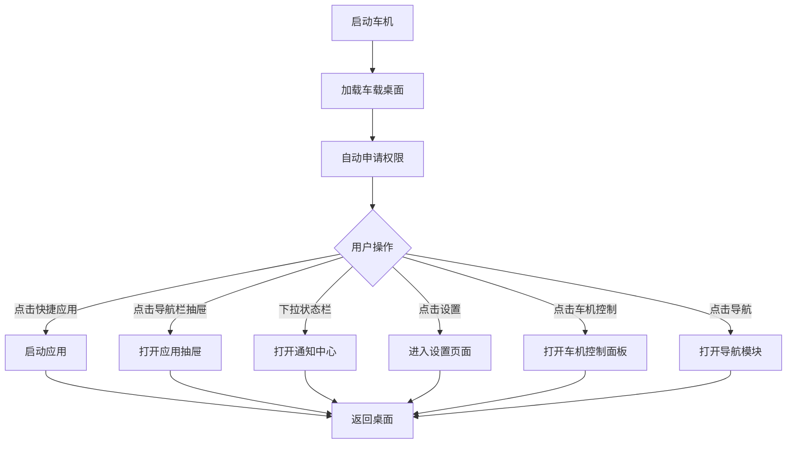

## 1. Product Overview
一款专为15.6寸1920*1080分辨率安卓10车机设计的高性能原生车载桌面软件，提供导航、通知管理、应用抽屉等核心功能，并深度集成车机硬件控制、仪表投屏、分屏显示等高级功能，注重安全性和易用性。
- 目标是打造轻量（APK<5MB）、高性能、美观的车载桌面，提升驾驶安全性和用户体验
- 支持车机硬件深度控制，实现真正的智能座舱体验

## 2. Core Features

### 2.1 Feature Module
1. **主屏**: 状态栏、时钟天气、快捷应用、导航栏
2. **应用抽屉**: 所有应用列表、搜索、分类管理
3. **通知中心**: 下拉通知栏、通知列表、快捷控制
4. **车机控制面板**: 空调控制、车窗控制、天窗控制、后备箱控制
5. **屏幕与显示控制**: 屏幕熄灭/唤醒、亮度调节、仪表亮度调节
6. **导航与投屏**: 仪表投屏高德地图、地图悬浮显示
7. **分屏显示**: 支持应用分屏多任务
8. **设置**: 主题设置、布局设置、壁纸设置、权限管理

### 2.2 Permission Requirements
| Permission | Purpose | Acquisition Method |
|-----------|---------|-------------------|
| Shell权限 | 执行车机控制命令 | 无线ADB自动获取 |
| 无障碍服务 | 系统级交互控制 | 用户手动授权 |
| 悬浮窗权限 | 地图悬浮显示 | 用户手动授权 |
| 系统签名权限 | 车机服务调用 | 系统集成或Root |
| 蓝牙权限 | 蓝牙设备管理 | 系统申请 |
| WiFi权限 | 网络状态获取 | 系统申请 |

### 2.3 Page Details
| Page Name | Module Name | Feature description |
|-----------|-------------|---------------------|
| 主屏 | 状态栏 | 显示时间、蓝牙、Wi-Fi、音量、电池等系统状态 |
| 主屏 | 时钟天气 | 显示当前时间、日期、天气信息 |
| 主屏 | 快捷应用 | 展示常用应用快捷入口，支持自定义 |
| 主屏 | 导航栏 | 底部导航，包含返回、主页、最近任务、抽屉等按钮 |
| 主屏 | 车机控制入口 | 快速访问车机控制面板 |
| 应用抽屉 | 应用列表 | 网格/列表布局展示所有已安装应用 |
| 应用抽屉 | 搜索功能 | 快速搜索并启动应用 |
| 应用抽屉 | 分类管理 | 支持按使用频率、名称排序 |
| 通知中心 | 下拉通知 | 可下拉显示通知列表 |
| 通知中心 | 快捷控制 | 亮度、音量、蓝牙、Wi-Fi等快速控制开关 |
| 车机控制面板 | 空调控制 | 温度调节（16-30℃）、风力调节（1-7档）、模式切换 |
| 车机控制面板 | 车窗控制 | 四窗独立开关、一键升降 |
| 车机控制面板 | 天窗控制 | 天窗开关、遮阳帘控制 |
| 车机控制面板 | 后备箱控制 | 后备箱开启/关闭 |
| 显示控制 | 屏幕控制 | 屏幕熄灭/唤醒、屏幕亮度调节（0-100%） |
| 显示控制 | 仪表控制 | 仪表亮度调节、仪表投屏切换 |
| 导航模块 | 地图投屏 | 高德地图投屏到仪表盘显示 |
| 导航模块 | 悬浮地图 | 地图悬浮窗显示，支持大小和位置调节 |
| 分屏显示 | 分屏管理 | 支持左右分屏、上下分屏、自由分屏 |
| 设置 | 主题设置 | 白天/黑夜模式切换、主题色选择 |
| 设置 | 壁纸设置 | 支持自定义壁纸选择 |
| 设置 | 权限管理 | ADB权限、无障碍权限、悬浮窗权限管理 |
| 设置 | 车机设置 | 车机服务配置、控制参数设置 |

## 3. Core Process
- 车机启动 → 显示车载桌面 → 自动申请必要权限（ADB/无障碍/悬浮窗） → 用户可快速访问常用应用、查看通知、控制车机硬件
- 下拉顶部状态栏查看通知和快捷控制
- 点击应用图标启动对应应用
- 通过底部导航栏返回主页或查看最近任务
- 通过车机控制面板调节空调、车窗等硬件
- 通过导航模块实现仪表投屏和悬浮地图

## 4. User Interface Design

### 4.1 Design Style
- **主色调**: 深色主题为主，辅助蓝色系，确保驾驶安全
- **按钮风格**: 圆角、大尺寸、高对比度，便于触控
- **字体**: Roboto，清晰易读，字号适中偏大
- **布局风格**: 卡片式布局，分区明确，减少视觉干扰
- **图标**: 矢量图标(Vector Drawable)，简洁明了，Material Design风格

### 4.2 Page Design Overview
| Page Name | Module Name | UI Elements |
|-----------|-------------|-------------|
| 主屏 | 状态栏 | 顶部固定，深色背景，白色图标文字 |
| 主屏 | 时钟天气 | 中部大尺寸显示，醒目清晰 |
| 主屏 | 快捷应用 | 网格布局，大图标大文字，便于点击 |
| 主屏 | 导航栏 | 底部固定，背景半透明，图标突出 |
| 主屏 | 车机控制入口 | 侧边栏或底部快捷入口，图标醒目 |
| 应用抽屉 | 应用列表 | 全屏覆盖，网格布局，支持滚动 |
| 通知中心 | 下拉通知 | 下拉式卡片，简洁列表形式 |
| 车机控制面板 | 空调控制 | 大旋钮/滑块，温度风力直观显示 |
| 车机控制面板 | 车窗控制 | 四窗图标，点击开关，状态反馈 |
| 车机控制面板 | 天窗控制 | 开关按钮，状态指示 |
| 车机控制面板 | 后备箱 | 大按钮，开启状态反馈 |
| 显示控制 | 屏幕控制 | 滑块调节亮度，开关控制熄灭 |
| 显示控制 | 仪表控制 | 滑块调节亮度，投屏切换按钮 |
| 导航模块 | 地图投屏 | 投屏状态显示，一键投屏/取消 |
| 导航模块 | 悬浮地图 | 悬浮窗控制，大小位置调节 |
| 分屏显示 | 分屏管理 | 分屏模式选择，应用分配 |
| 设置 | 设置页面 | 侧边栏+内容区，分类清晰 |

### 4.3 Responsiveness
- 专为1920*1080横屏设计
- 触控优化，按钮最小尺寸48dp
- 大间距、大字体，符合驾驶场景使用习惯
- 车机控制面板采用大按钮设计，便于驾驶中操作

### 4.4 Vector Icons
- 使用Android Vector Drawable矢量图标，确保清晰度
- 支持不同密度屏幕适配
- 统一的线性图标风格
- 车机控制图标采用高对比度设计，确保驾驶场景可见性

## 5. Car Hardware Control Specifications

### 5.1 Air Conditioning Control
- **Temperature Range**: 16-30℃, step 0.5℃
- **Wind Level**: 1-7 levels
- **Modes**: Auto, Cool, Heat, Vent, Defrost
- **Control Method**: ADB Shell command or Car Service API

### 5.2 Window Control
- **Front Left/Right**: Individual control
- **Rear Left/Right**: Individual control
- **One-touch**: All windows up/down
- **Control Method**: ADB Shell command or CAN Bus

### 5.3 Sunroof Control
- **Open/Close**: Full control
- **Sunshade**: Independent control
- **Tilt**: Support tilt mode

### 5.4 Trunk Control
- **Open**: Remote open
- **Close**: Remote close (if supported)
- **Status Feedback**: Open/closed status

## 6. Display Control Specifications

### 6.1 Screen Control
- **Screen Off**: Immediate screen off
- **Screen On**: Wake up screen
- **Brightness**: 0-100% adjustment
- **Auto Brightness**: Support auto adjustment

### 6.2 Instrument Panel Control
- **Brightness**: 0-100% adjustment
- **Map Projection**: Project navigation to instrument panel
- **Projection Source**: Amap Auto (高德地图车机版)
- **Projection Method**: Mirror or dedicated API

## 7. Navigation Module Specifications

### 7.1 Map Projection
- **Target**: Instrument panel display
- **Source**: Amap Auto application
- **Trigger**: Automatic or manual
- **Exit**: Manual exit or navigation end

### 7.2 Floating Map
- **Display**: Overlay on desktop
- **Size**: Adjustable (small/medium/large)
- **Position**: Adjustable (corners or custom)
- **Interaction**: Support drag and resize
- **Permissions**: SYSTEM_ALERT_WINDOW

## 8. Split Screen Specifications

### 8.1 Split Modes
- **Left-Right Split**: 50/50 or custom ratio
- **Top-Bottom Split**: 50/50 or custom ratio
- **Free Split**: User-defined layout

### 8.2 Supported Apps
- Navigation + Music
- Navigation + Video
- Any two apps combination

## 9. Permission Management

### 9.1 ADB Permission
- **Acquisition**: Wireless ADB automatic acquisition
- **Method**: Pairing code + IP connection
- **Persistence**: Persistent after authorization
- **Fallback**: Manual ADB authorization

### 9.2 Accessibility Service
- **Purpose**: System-level interaction
- **Authorization**: User manual authorization
- **Features**: Global actions, window detection

### 9.3 Floating Window Permission
- **Purpose**: Map floating display
- **Authorization**: User manual authorization
- **Management**: Can be enabled/disabled in settings
