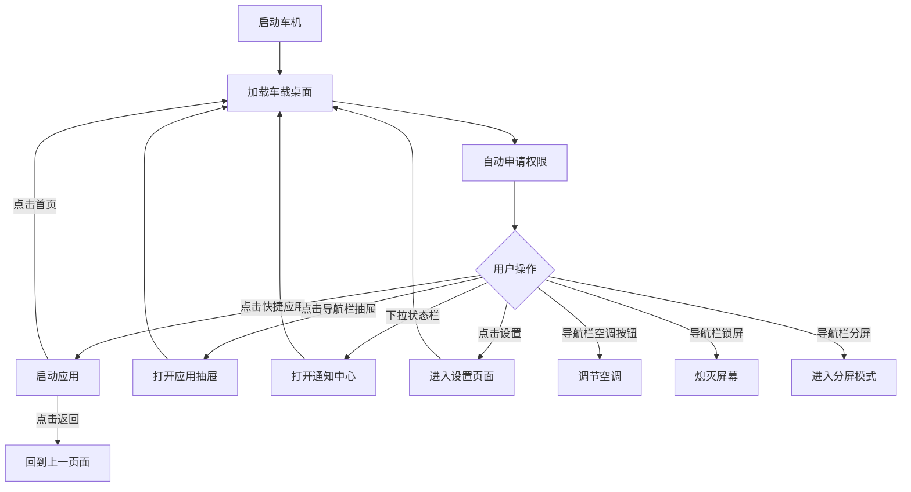

## 1. Product Overview
一款专为15.6寸1920*1080分辨率安卓10车机设计的高性能原生车载桌面软件，提供导航、通知管理、应用抽屉等核心功能，并深度集成车机硬件控制、仪表投屏、分屏显示等高级功能，注重安全性和易用性。
- 目标是打造轻量（APK<5MB）、高性能、美观的车载桌面，提升驾驶安全性和用户体验
- 支持车机硬件深度控制，实现真正的智能座舱体验

## 2. Core Features

### 2.1 Feature Module
1. **全局导航栏**: 始终显示在屏幕底部，包含导航按钮和空调快捷控制，所有应用显示区域自动排除导航栏和状态栏
2. **全局状态栏**: 始终显示在屏幕顶部，支持下拉打开通知中心
3. **主屏**: 时钟天气、快捷应用
4. **应用抽屉**: 所有应用列表、搜索、分类管理
5. **通知中心**: 下拉通知栏、通知列表、快捷控制卡片（车控/显示控制）
6. **空调控制**: 导航栏集成温度/风力调节，内外循环切换
7. **车机控制面板**: 车窗控制、天窗控制、后备箱控制（位于通知中心快捷卡片）
8. **屏幕与显示控制**: 屏幕熄灭/唤醒、亮度调节、仪表亮度调节（位于通知中心快捷卡片）
9. **导航与投屏**: 仪表投屏高德地图、地图悬浮显示
10. **分屏显示**: 支持应用分屏多任务
11. **设置**: 主题设置、布局设置、壁纸设置、权限管理、导航栏设置

### 2.2 Permission Requirements
| Permission | Purpose | Acquisition Method |
|-----------|---------|-------------------|
| Shell权限 | 执行车机控制命令 | adb connect 127.0.0.1:5555 |
| 无障碍服务 | 系统级交互控制（返回/最近任务等） | 用户手动授权 |
| 悬浮窗权限 | 地图悬浮显示 | 用户手动授权 |
| 系统签名权限 | 车机服务调用 | 系统集成或Root |
| 蓝牙权限 | 蓝牙设备管理 | 系统申请 |
| WiFi权限 | 网络状态获取 | 系统申请 |

### 2.3 Page Details
| Page Name | Module Name | Feature description |
|-----------|-------------|---------------------|
| 全局导航栏 | 导航按钮 | 返回（回到上一页面）、首页（回到本应用首页）、最近任务 |
| 全局导航栏 | 空调快捷控制 | 温度+/温度数值/温度-、风力+/风力数值/风力-、内外循环切换 |
| 全局导航栏 | 系统快捷按钮 | 锁屏、分屏、系统设置 |
| 全局状态栏 | 系统状态 | 显示时间、蓝牙、Wi-Fi、音量、电池、ADB连接状态 |
| 全局状态栏 | 下拉入口 | 下拉打开通知中心 |
| 主屏 | 时钟天气 | 显示当前时间、日期、天气信息 |
| 主屏 | 快捷应用 | 展示常用应用快捷入口，支持自定义 |
| 应用抽屉 | 应用列表 | 网格布局展示所有已安装应用 |
| 应用抽屉 | 搜索功能 | 快速搜索并启动应用 |
| 通知中心 | 下拉通知 | 从状态栏下拉显示通知列表 |
| 通知中心 | 快捷卡片-车控 | 车窗控制、天窗控制、后备箱控制 |
| 通知中心 | 快捷卡片-显示 | 屏幕熄灭/唤醒、亮度调节、仪表亮度调节、投屏控制 |
| 通知中心 | 快捷开关 | 蓝牙、Wi-Fi、亮度、音量等快速开关 |
| 导航模块 | 地图投屏 | 高德地图投屏到仪表盘显示 |
| 导航模块 | 悬浮地图 | 地图悬浮窗显示，支持大小和位置调节 |
| 分屏显示 | 分屏管理 | 支持左右分屏、上下分屏 |
| 设置 | 主题设置 | 白天/黑夜模式切换、主题色选择 |
| 设置 | 壁纸设置 | 支持自定义壁纸选择 |
| 设置 | 导航栏设置 | 全局显示开关、按钮自定义排序 |
| 设置 | 权限管理 | ADB权限、无障碍权限、悬浮窗权限管理 |
| 设置 | 车机设置 | 车机服务配置、控制参数设置 |

## 3. Core Process
- 车机启动 → 显示车载桌面 → 自动申请必要权限（ADB/无障碍/悬浮窗） → 用户可快速访问常用应用、查看通知、控制车机硬件
- 全局导航栏始终可见，任何应用下均可操作返回、首页、空调控制
- 下拉顶部状态栏查看通知和快捷控制卡片
- 点击首页按钮回到本应用首页（不是系统桌面）
- 点击返回按钮回到上一页面（通过无障碍服务实现）
- 其他应用显示区域自动排除导航栏和状态栏，避免遮挡

## 4. User Interface Design

### 4.1 Design Style
- **主色调**: 深色主题为主，辅助蓝色系，确保驾驶安全
- **按钮风格**: 圆角、大尺寸、高对比度，便于触控
- **字体**: Roboto，清晰易读，字号适中偏大
- **布局风格**: 卡片式布局，分区明确，减少视觉干扰
- **图标**: 矢量图标(Vector Drawable)，简洁明了，Material Design风格
- **动画**: macOS风格动画（弹簧缩放、滑入滑出、弹性按压反馈）

### 4.2 导航栏设计（核心交互区域）
导航栏是本应用最核心的交互区域，始终显示在屏幕底部，高度约80dp。

**布局从左到右：**

| 区域 | 按钮 | 图标 | 说明 |
|------|------|------|------|
| 导航区 | 返回 | ic_back | 回到上一页面（AccessibilityService） |
| 导航区 | 首页 | ic_home | 回到本应用首页 |
| 导航区 | 最近任务 | ic_recent | 打开最近任务列表 |
| 分隔线 | | | 视觉分隔 |
| 空调区 | 温度- | ic_temp_down | 降低温度0.5℃ |
| 空调区 | 温度数值 | 文字"24°" | 显示当前温度，点击可快速调节 |
| 空调区 | 温度+ | ic_temp_up | 升高温度0.5℃ |
| 空调区 | 风力- | ic_fan_down | 降低风力1档 |
| 空调区 | 风力数值 | 文字"3" | 显示当前风力档位 |
| 空调区 | 风力+ | ic_fan_up | 升高风力1档 |
| 空调区 | 内外循环 | ic_cycle_inner/ic_cycle_outer | 切换内循环/外循环，图标随状态变化 |
| 分隔线 | | | 视觉分隔 |
| 系统区 | 锁屏 | ic_lock | 熄灭屏幕 |
| 系统区 | 分屏 | ic_split | 进入/退出分屏模式 |
| 系统区 | 系统设置 | ic_settings | 打开系统设置 |

**设计要点：**
- 导航按钮使用图标，空调控制使用图标+数字组合
- 温度和风力数值使用醒目的数字显示，便于驾驶中快速读取
- 内外循环按钮图标随状态切换，提供视觉反馈
- 所有按钮支持macOS风格按压动画反馈

### 4.3 状态栏设计
- 固定在屏幕顶部，高度约56dp
- 左侧：时间、日期
- 右侧：ADB连接状态指示、WiFi、蓝牙、电池
- 支持下拉手势打开通知中心

### 4.4 通知中心设计（下拉面板）
从状态栏下拉打开，覆盖主内容区域（不覆盖导航栏和状态栏）。

**布局：**
1. **通知列表区**：上半部分，显示系统通知
2. **快捷卡片区**：下半部分，横向滑动的卡片列表
   - **车控卡片**：车窗开关（四窗独立）、天窗开关、后备箱开关
   - **显示卡片**：屏幕亮度滑块、仪表亮度滑块、熄屏/亮屏按钮、投屏按钮
   - **快捷开关**：WiFi、蓝牙、音量等开关

### 4.5 设置页面设计
- 横屏适配：左侧导航列表 + 右侧内容区
- 权限管理移入设置页面，作为子页面
- 导航栏设置：全局显示开关、按钮排序

### 4.6 Page Design Overview
| Page Name | Module Name | UI Elements |
|-----------|-------------|-------------|
| 全局导航栏 | 导航区 | 底部固定，图标按钮，按压动画 |
| 全局导航栏 | 空调区 | 图标+数字组合，温度/风力实时显示 |
| 全局导航栏 | 系统区 | 图标按钮，锁屏/分屏/设置 |
| 全局状态栏 | 系统状态 | 顶部固定，深色背景，白色图标文字 |
| 全局状态栏 | 下拉入口 | 下拉手势，下拉箭头指示 |
| 主屏 | 时钟天气 | 中部大尺寸显示，醒目清晰 |
| 主屏 | 快捷应用 | 网格布局，大图标大文字 |
| 应用抽屉 | 应用列表 | 全屏覆盖，网格布局，支持滚动 |
| 通知中心 | 下拉面板 | 下拉式面板，通知列表+快捷卡片 |
| 通知中心 | 车控卡片 | 卡片式布局，车窗/天窗/后备箱开关 |
| 通知中心 | 显示卡片 | 卡片式布局，亮度滑块+投屏按钮 |
| 设置 | 设置页面 | 左侧导航+右侧内容，横屏适配 |
| 设置 | 权限管理 | 设置子页面，状态检测+操作按钮 |

### 4.7 Responsiveness
- 专为1920*1080横屏设计
- 三级尺寸适配：values(手机) / sw600dp(7-10寸) / sw720dp(10寸以上车机)
- 触控优化，按钮最小尺寸48dp
- 大间距、大字体，符合驾驶场景使用习惯
- 导航栏空调控制数字醒目，驾驶中可快速读取

### 4.8 Vector Icons
- 使用Android Vector Drawable矢量图标，确保清晰度
- 统一的线性图标风格
- 空调图标：温度上下箭头、风力上下箭头、内外循环切换图标
- 系统图标：锁屏、分屏、设置

## 5. Car Hardware Control Specifications

### 5.1 Air Conditioning Control
- **Temperature Range**: 16-30℃, step 0.5℃
- **Wind Level**: 1-7 levels
- **Cycle Mode**: Inner cycle / Outer cycle toggle
- **Control Location**: 导航栏快捷按钮
- **Display**: 温度数值（如"24°"）和风力数值（如"3"）实时显示在导航栏
- **Control Method**: ADB Shell command or Car Service API

### 5.2 Window Control
- **Front Left/Right**: Individual control
- **Rear Left/Right**: Individual control
- **One-touch**: All windows up/down
- **Control Location**: 通知中心快捷卡片
- **Control Method**: ADB Shell command or CAN Bus

### 5.3 Sunroof Control
- **Open/Close**: Full control
- **Sunshade**: Independent control
- **Control Location**: 通知中心快捷卡片

### 5.4 Trunk Control
- **Open**: Remote open
- **Close**: Remote close (if supported)
- **Control Location**: 通知中心快捷卡片

## 6. Display Control Specifications

### 6.1 Screen Control
- **Screen Off**: 导航栏锁屏按钮
- **Screen On**: Power key or touch
- **Brightness**: 通知中心快捷卡片滑块调节
- **Auto Brightness**: Support auto adjustment

### 6.2 Instrument Panel Control
- **Brightness**: 通知中心快捷卡片滑块调节
- **Map Projection**: 通知中心快捷卡片投屏按钮
- **Projection Source**: Amap Auto (高德地图车机版)

## 7. Navigation Bar Specifications

### 7.1 Global Display
- **Default**: 导航栏始终显示在所有应用之上
- **Setting**: 支持在设置中关闭全局显示（仅在本应用内显示）
- **Implementation**: 通过悬浮窗权限实现全局覆盖
- **Layout**: 其他应用显示区域自动排除导航栏高度，避免内容遮挡

### 7.2 Button Behavior
| Button | Action | Implementation |
|--------|--------|---------------|
| 返回 | 回到上一页面 | AccessibilityService.performGlobalBack() |
| 首页 | 回到本应用首页 | Intent启动HomeActivity，非系统HOME |
| 最近任务 | 打开最近任务列表 | AccessibilityService.performGlobalRecent() |
| 锁屏 | 熄灭屏幕 | ADB Shell: input keyevent 26 / settings put system screen_brightness 0 |
| 分屏 | 进入/退出分屏模式 | SplitScreenManager |
| 系统设置 | 打开系统设置 | Intent ACTION_SETTINGS |

### 7.3 AC Control in Navigation Bar
| Control | Action | Display |
|---------|--------|---------|
| 温度+ | 升高0.5℃ | 数值更新（如24°→24.5°） |
| 温度- | 降低0.5℃ | 数值更新 |
| 温度数值 | 显示当前温度 | 文字"24°" |
| 风力+ | 升高1档 | 数值更新（如3→4） |
| 风力- | 降低1档 | 数值更新 |
| 风力数值 | 显示当前风力 | 文字"3" |
| 内外循环 | 切换循环模式 | 图标切换（内循环/外循环） |

## 8. Notification Center Specifications

### 8.1 Pull-down Interaction
- **Trigger**: 从状态栏区域向下拖拽
- **Animation**: macOS风格滑入动画
- **Range**: 覆盖主内容区域，不覆盖导航栏和状态栏
- **Dismiss**: 向上滑动或点击关闭按钮

### 8.2 Quick Cards
- **Car Control Card**: 车窗四窗独立开关、天窗开关、后备箱开关
- **Display Card**: 屏幕亮度滑块、仪表亮度滑块、熄屏/亮屏、投屏切换
- **Quick Toggles**: WiFi开关、蓝牙开关、音量调节

## 9. Split Screen Specifications

### 9.1 Split Modes
- **Left-Right Split**: 50/50 or custom ratio
- **Top-Bottom Split**: 50/50 or custom ratio

### 9.2 Supported Apps
- Navigation + Music
- Navigation + Video
- Any two apps combination

## 10. Permission Management

### 10.1 ADB Permission
- **Acquisition**: adb connect 127.0.0.1:5555
- **Prerequisite**: 用户需先在开发者选项开启无线调试，并通过电脑配对授权
- **Auth Flow**: 连接时系统自动弹出RSA公钥授权对话框
- **Persistence**: 授权后持久有效
- **Management**: 设置 → 权限管理 → ADB权限

### 10.2 Accessibility Service
- **Purpose**: 返回键、最近任务等系统级操作
- **Authorization**: 用户手动授权
- **Management**: 设置 → 权限管理 → 无障碍服务

### 10.3 Floating Window Permission
- **Purpose**: 全局导航栏、地图悬浮显示
- **Authorization**: 用户手动授权
- **Management**: 设置 → 权限管理 → 悬浮窗权限

## 11. Settings Page Specifications

### 11.1 Page Layout
- 横屏适配：左侧导航列表（约200dp宽） + 右侧内容区
- 分类清晰，层级不超过2层

### 11.2 Settings Items
| Category | Item | Description |
|----------|------|-------------|
| 外观 | 主题模式 | 白天/黑夜/自动 |
| 外观 | 主题色 | 蓝色/绿色/橙色等 |
| 外观 | 壁纸 | 自定义壁纸 |
| 导航栏 | 全局显示 | 开关：始终显示/仅本应用 |
| 导航栏 | 按钮排序 | 自定义导航栏按钮顺序 |
| 权限管理 | ADB权限 | 连接/断开/状态检测 |
| 权限管理 | 无障碍服务 | 开启引导/状态检测 |
| 权限管理 | 悬浮窗权限 | 开启引导/状态检测 |
| 车机 | 默认温度 | 空调默认温度设置 |
| 车机 | 默认风力 | 空调默认风力设置 |
| 关于 | 版本信息 | 应用版本号 |
| 关于 | 日志查看 | 查看应用运行日志 |
